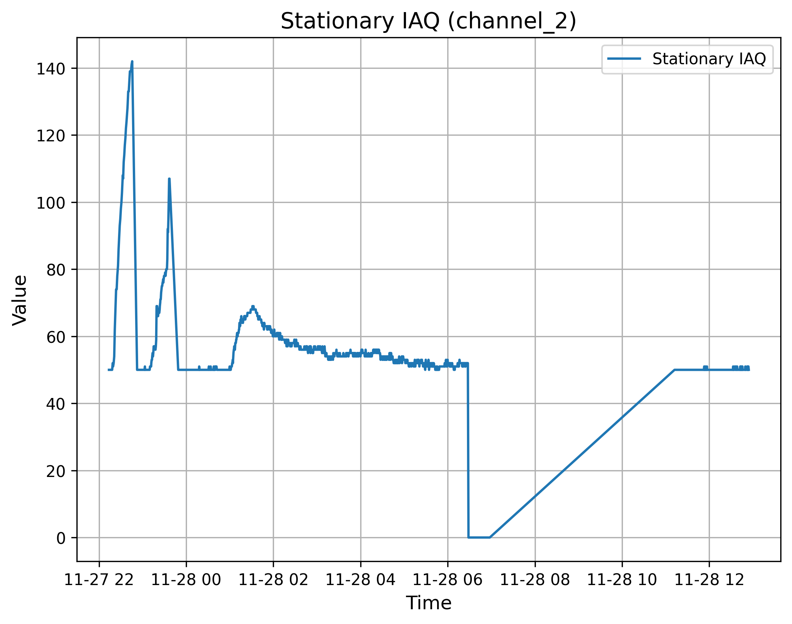
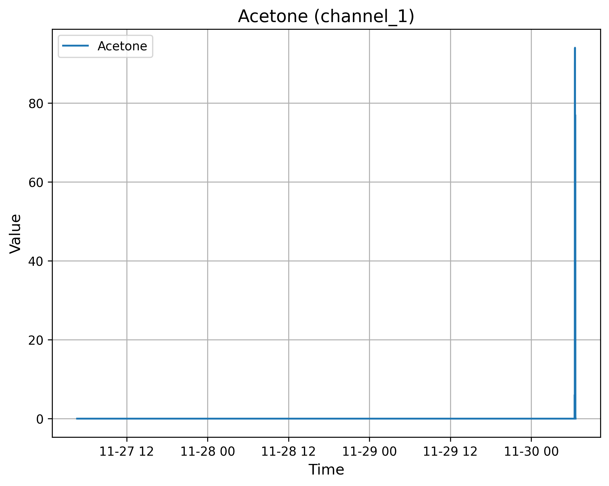

# Python Data Visualization Tool for ThingSpeak Channels

 - This Python project fetches, cleans, and visualizes data from ThingSpeak channels, saving data in SQLite databases and CSV files. It generates individual and grid-based visualizations of channel data.
## Table of Contents

- [Overview](#overview)
- [Features](#features)
- [File Structure](#file-structure)
- [Prerequisites](#prerequisites)
- [Usage](#usage)
  - [Step 1: Configure Channels](#step-1-configure-channels)
  - [Step 2: Run the Main Script](#step-2-run-the-main-script)
  - [Step 3: View Results](#step-3-view-results)
- [Modules](#modules)
  - [1. main.py](#1-mainpy)
  - [2. dbHandler.py](#2-dbhandlerpy)
  - [3. plotting.py](#3-plottingpy)
  - [4. config.py](#4-configpy)
- [Example Output](#example-output)
- [Future Enhancements](#future-enhancements)
- [Issues and Troubleshooting](#issues-and-troubleshooting)
- [License](#license)
- [Author](#author)


## Overview

- This Python project is designed to fetch, clean, and visualize data from ThingSpeak channels. It dynamically handles multiple channels, processes their data, and saves it in both database (.db) and CSV formats. Finally, it generates visualizations in a 4x4 grid layout and individual plots, saving them as images.
---

## Features

1. **Dynamic Data Handling**:
   - Fetches data from ThingSpeak channels.
   - Cleans and stores data dynamically in an SQLite database.
   - Supports multiple channels and customizable fields.

2. **Visualization**:
   - Generates 4x4 grid plots for combined data.
   - Creates individual field plots saved as png"s.

3. **Configuration Management**:
   - Uses `config.json` for channel labels and fields.
   - Securely handles API keys in `keys.json`.

4. **Reusable Architecture**:
   - Modularized database, visualization, and configuration management.

---
## How It Works

1. The `main.py` script calls `dbHandler.py` to fetch data from ThingSpeak channels using their API keys.
2. The data is cleaned and stored in a SQLite database (`thingspeak_data.db`).
3. Plots are generated using `plotting.py`, which creates a 4x4 grid and individual png" files for each field.
4. Results are saved in the `plots/` directory and displayed in the terminal.

---

## File Structure
``` bash 
Project Root
├── main.py                 # Main script to execute the project.
├── dbHandler.py            # Manages database creation, data fetching, and storage.
├── plotting.py             # Handles data visualization and plot generation.
├── config.py               # Manages channel configuration and API keys.
├── keys.json               # Stores API keys securely (excluded from Git).
├── config.json             # Stores channel configurations (auto-generated and excluded from Git).
├── plots/                  # Folder where all plots are saved.
├── cleaned_plots/          # Folder where custom plots are saved.
├── data/                   # Folder data points are manually moved and saved here.
├── requirements.txt        # Python dependencies.
``` 

---
## Prerequisites

1. **Python Version**:
   Requires Python 3.8 or above.

2. **Required Libraries**:
   Install dependencies with:
   ```bash
   pip install -r requirements.txt
   ```
---

## Usage

### Step 1: Configure Channels

 - Edit keys.json to include your ThingSpeak API keys in the following format:
```json

{
  "api_keys": {
    "channel_1": "API_KEY_1",
    "channel_2": "API_KEY_2"
  }
}
```
 - The config.json file will be auto-generated with default values for channels. Customize it as needed:
```json 
{
  "channel_1": {
    "id": 2753096,
    "fields": 5,
    "api_key": "API_KEY_1",
    "labels": ["Ambient", "Acetone", "Ethyl Acetate", "Ethanol", "Accuracy"]
  },
  "channel_2": {
    "id": 2758654,
    "fields": 8,
    "api_key": "API_KEY_2",
    "labels": [
      "Gas Resistance (Ohms)", "Pressure (Pa)", "Stationary IAQ",
      "Breath VOC Equivalent (ppm)", "CO2 Equivalent (ppm)",
      "Compensated Temperature (°C)", "Compensated Humidity (Relative %)", "BSEC Accuracy (/3)"
    ]
  }
}
```

### Step 2: Run the Main Script

 - Execute the main.py script:

``` bash 
python main.py
```

### Step 3: View Results

 - Database: The data is stored in thingspeak_data.db.
 - CSV Files: Individual channel data is saved in the project root.
 - Plots: Visualizations are saved in the plots/ directory.

---

## Modules

 ### 1. main.py

Coordinates the workflow:

 - Fetches data using dbHandler.py.
 - Visualizes the data using plotting.py.

### 2. dbHandler.py

Handles:
 - Database creation and dynamic table generation.
 - Data fetching, cleaning, and storage.
 - Exporting database tables to CSV files.
 - 
### 3. plotting.py
Manages:
 - 4x4 grid visualization of all channels.
 - Individual plots for each field.

### 4. config.py
 - Reads and writes channel configurations.
 - Ensures secure handling of API keys.

---
## Example Output

 #### Individual Plots:
 
Each field’s data is plotted and saved as a separate png file in the plots/ folder.
<table>
  <tr>
    <td></td>
    <td></td>
    <td></td>
  </tr>
  <tr>
    <td></td>
    <td></td>
    <td></td>
  </tr>
  <tr>
    <td></td>
    <td></td>
    <td></td>
  </tr>
  <tr>
    <td></td>
    <td></td>
    <td></td>
  </tr>
</table>

---
### 4x4 Grid Plot:
Visualizes all fields from both channels in a single grid.
 
---

## License 
Licensed under GNU

---
## Author

Harry C; @[GitHub](https://github.com/cheuh008/)


---


